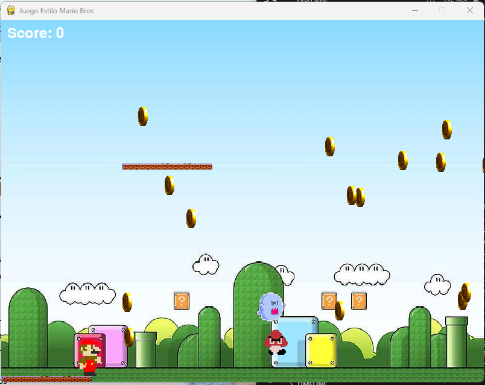

# 🍄 Mario Bros Clone (Pygame)  

 *Captura del juego*  

Un clon del clásico Mario Bros desarrollado en **Python con Pygame**, creado como proyecto educativo para practicar mecánicas de plataformas, colisiones y animaciones.  

## 📜 Descripción
Proyecto educativo creado para aprender:
- Mecánicas de plataformas 2D
- Sistemas de colisiones
- Animaciones de sprites
- Manejo de estados del juego

**NOTA LEGAL:** Este es un proyecto de aprendizaje. Todos los assets visuales/sonoros son propiedad intelectual de Nintendo y se usan únicamente con fines educativos.
## 🎮 **Características**  
- Movimiento fluido con **gravedad y salto doble**.  
- **Sistema de combate**: Dispara bolas de fuego (`Tecla F`).  
- Enemigos con IA básica (movimiento y colisiones).  
- **Monedas coleccionables** con animaciones.  
- Fantasmas con patrones de movimiento aleatorios.  
- Música y efectos de sonido.  
- Pantallas de **Game Over** y **Victoria**.  

## ⚙️ **Instalación**  
1. Clona el repositorio:  
   ```bash
   git clone https://github.com/JhosProgramador/mario-clone-game.git

2. Instala Pygame (requiere Python 3.6+):

bash
pip install pygame

3. Ejecuta el juego:

bash
python SuperMariofuego.py

gracias
